# Frequently Asked Questions (FAQ)

This FAQ page was created to address some common questions you may have while visiting this website. This English version is machine-translated.

## I. What is Nobihaza Vietnam Community Collection?

This website, created by [Serena1432](https://s1432.org), is designed to compile (almost all) Nobihaza games into one platform. The goal is to help Nobihaza players easily find and follow the games they enjoy.

Additionally, the site integrates with Discord (and later a chatbot) to synchronize and notify players about new games more efficiently!

## II. Searching for and Downloading Games

1. You can search for games through the categories on the [homepage](/) or [custom search](/search).
2. Click on a game to view its details.
3. Scroll to the **Download Game** section, download the game, extract the files, and play. Instructions are typically included in the description of each game.

## III. Game File Extraction Passwords

For game files uploaded by [Serena1432](/profile/1), the extraction password is `nbhzvn`.

Other uploaders may use different passwords, usually mentioned in the game description. However, it is recommended for all uploaders to use the same password as those uploaded by Serena1432.

## IV. Tools to Play Games

Some games require specific software or libraries to run. These are usually noted in the game description. Here’s a summary of commonly needed tools:

- **[EasyRPG](/tools/EasyRPG%20Ti%E1%BA%BFng%20Vi%E1%BB%87t%20%280.8%29/)**: Emulates games created with **RPG Maker 2000/2003**. Supported on PCs and mobile devices (Android/iOS). You can also find Vietnamese-language games supporting EasyRPG by using the [easyrpg tag](/search?tags=easyrpg).
- **[JoiPlay](/tools/JoiPlay/)**: Emulates games made with **RPG Maker XP to MV** on Android (not supported on iOS). Use the [joiplay tag](/search?tags=joiplay) to find compatible games.
- **[MKXP](/tools/MKXP/)**: Emulates some games made with **RPG Maker XP to VX Ace** with better graphics, although it supports fewer games.
- **[RPG Maker English RTP](https://www.rpgmakerweb.com/run-time-package)**: Contains all resource packs for RPG Maker from 2000 to VX Ace. If you cannot run a game, install both English and Japanese RTP versions.
- **[RPG Maker Japanese RTP](https://rpgmakerofficial.com/support/rtp/)**: Similar to the English version but supports Japanese games or games translated from Japanese.

## V. Reporting Game Issues

If you encounter issues downloading, extracting, or playing a game, you can comment on the game’s page to notify the uploader or [contact Serena1432](https://s1432.org/contact) for assistance.

## VI. Becoming an Uploader

Want to upload your games or contribute games from your collection to the website?

[Contact Serena1432](https://s1432.org/contact) to request uploader privileges. Once granted, you’ll see an **Upload Game** button in your account dashboard.

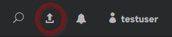

Your profile will also include a **Uploaded Games** section, listing your contributions to the website.

Thank you for contributing to the site and the community!

## VII. Registering an Account

Registering an account lets you track your favorite games, leave reviews, and comment on games with other members and uploaders.

1. Click the user icon at the top right to log in or sign up.

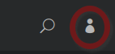

2. Log in or sign up for a new account. You can also use your Discord account.

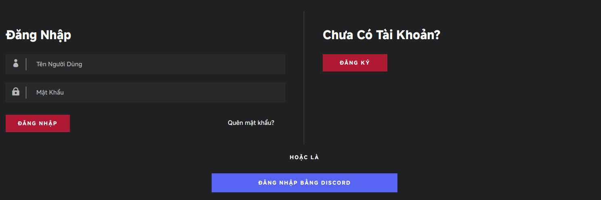

3. Enter your username, email, and password.

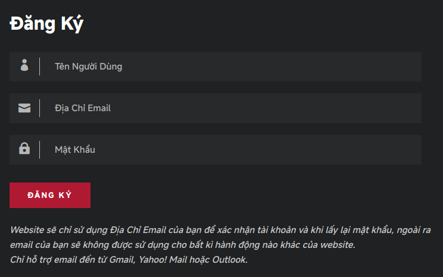

4. Register and check your email for verification. You’ll receive an email similar to this:

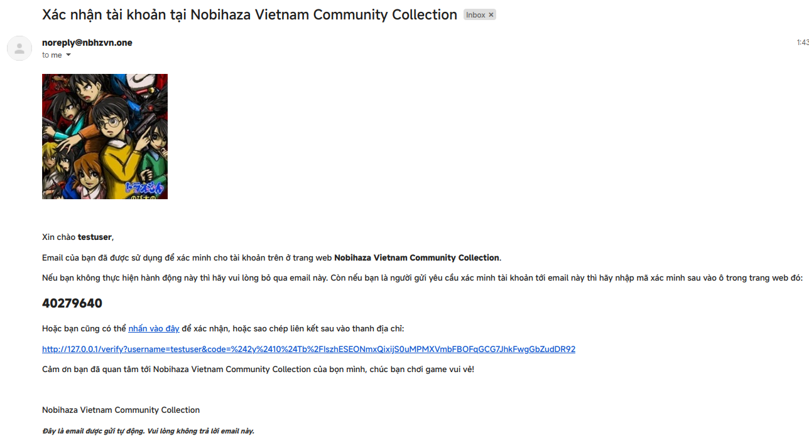

5. Enter the verification code or click the link to complete registration. If you see a message like this, your account has been successfully created!

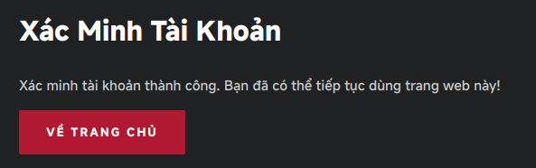

## VIII. Tracking Games

Tracking a game lets you receive notifications when its information is updated or new comments are added (useful for bug fixes or important updates).

Simply click **Follow** on a game page, and it will appear in your account’s tracked games list.

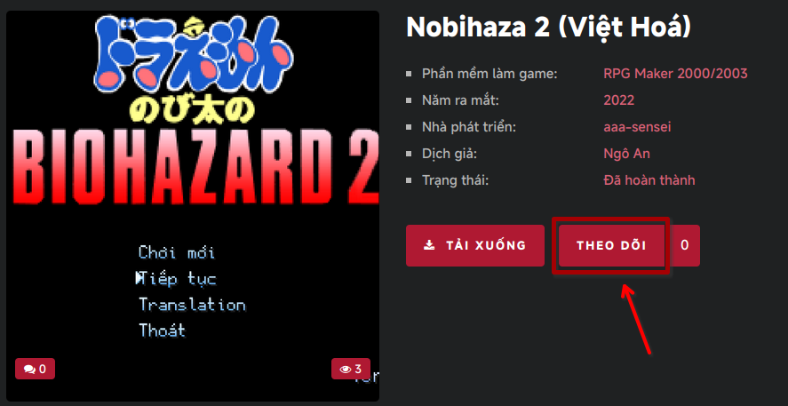

Be mindful not to follow too quickly, as the site has a time limit between follows to prevent spam.

## IX. Reviewing and Commenting on Games

### Reviewing Games

Each game has a review section where you can rate it from 1 to 5 stars. Simply click on the star rating you wish to give.

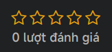

You cannot undo a review once submitted, and you cannot review a game you uploaded yourself.

### Commenting on Games

You can comment on games as you would on social media posts. Others can reply to your comments or mention you in their comments.

To mention someone, use `@username`, where `username` is their profile username.

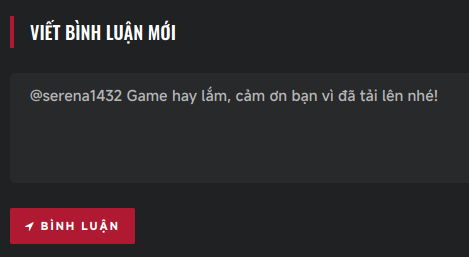

After writing your comment, click **Comment**.

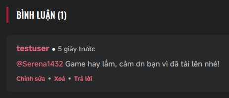

To prevent spam, there is a one-minute cooldown between comments.

## X. Notifications

The site sends notifications for actions related to games you follow or when someone mentions you in a comment.

Notifications appear as a count in the top-right corner:

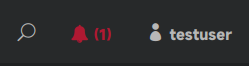

Click the notification icon to see new messages (highlighted in red). You can also click a notification to view the related comment.

You can delete notifications if you wish.

## XI. Website Source Code

Did you know the source code of this site is [available on GitHub](https://github.com/Serena1432/NobihazaVietnamCollection)? This means you can create your own website using this template and learn how this site operates.

## XII. Contacting Serena1432

You can contact Serena1432 here: [https://s1432.org/contact](https://s1432.org/contact)